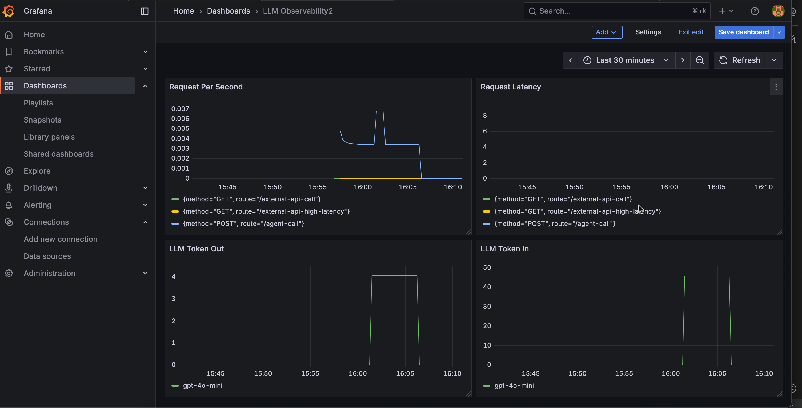

# Agent Observability

A comprehensive observability solution for AI agents built with LangChain and LangGraph, featuring OpenTelemetry tracing, Prometheus metrics, and Grafana dashboards.

## Overview

This project demonstrates how to implement production-ready observability for AI agents, providing:

- **Distributed Tracing**: Track agent execution flows across LLM calls, tool invocations, and API requests
- **Metrics Collection**: Monitor token usage, latency, errors, and throughput
- **Real-time Monitoring**: Visualize performance and health through Grafana dashboards
- **Production-ready**: Built with FastAPI and designed for scalable deployment

## Features

### 🔍 **Comprehensive Tracing**
- HTTP request tracing with middleware
- LLM call instrumentation (OpenAI GPT-4)
- Tool execution tracking (weather API calls)
- Error recording and exception handling

### 📊 **Rich Metrics**
- **Token Usage**: Input/output token consumption tracking
- **Latency Monitoring**: HTTP requests, LLM calls, and external API latency
- **Error Tracking**: Categorized error counting by component
- **Request Throughput**: HTTP request rates and status codes

### 🎯 **Agent Intelligence**
- Simple routing logic for weather queries
- Real weather data integration via Open-Meteo API
- LangGraph workflow management
- Structured state management

### 🚀 **Production Stack**
- FastAPI web framework
- Prometheus metrics collection
- Grafana visualization
- Docker Compose orchestration

## Architecture

```
┌─────────────┐    ┌──────────────┐    ┌─────────────┐
│   FastAPI   │    │  LangGraph   │    │ OpenTelemetry│
│   Server    │───▶│   Agent      │───▶│   Tracing   │
│             │    │              │    │             │
└─────────────┘    └──────────────┘    └─────────────┘
       │                   │                   │
       ▼                   ▼                   ▼
┌─────────────┐    ┌──────────────┐    ┌─────────────┐
│ Prometheus  │    │   OpenAI     │    │   Weather   │
│  Metrics    │    │    API       │    │     API     │
└─────────────┘    └──────────────┘    └─────────────┘
       │
       ▼
┌─────────────┐
│   Grafana   │
│ Dashboards  │
└─────────────┘
```

## Quick Start

### Prerequisites

- Python 3.12+
- Docker & Docker Compose
- OpenAI API key

### 1. Clone and Setup

```bash
git clone <repository-url>
cd agent_observability
```

### 2. Install Dependencies

Using uv (recommended):
```bash
uv sync
```

Or using pip:
```bash
pip install -e .
```

### 3. Environment Configuration

Create a `.env` file:
```bash
OPENAI_API_KEY=your_openai_api_key_here
```

### 4. Start Monitoring Stack

```bash
docker-compose up -d
```

This starts:
- **Prometheus**: http://localhost:9090
- **Grafana**: http://localhost:3000 (admin/admin)

### 5. Run the Agent API

```bash
uv run api
```

The API will be available at http://localhost:8000

## API Endpoints

### Core Endpoints

- `GET /` - Health check
- `POST /agent-call` - Main agent endpoint

### Test Endpoints

- `GET /external-api-call` - Simulated API call (1-5s latency)
- `GET /external-api-high-latency` - High latency simulation (30-50s)

### Agent Usage Example

```bash
curl -X POST "http://localhost:8000/agent-call" \
  -H "Content-Type: application/json" \
  -d '{"query": "What is the weather in Paris?"}'
```

Response:
```json
{
  "query": "What is the weather in Paris?",
  "response": "The weather in Paris is 15°C, windspeed 10 km/h."
}
```

## Monitoring & Observability

### Metrics Available

| Metric | Type | Description |
|--------|------|-------------|
| `llm_tokens_in` | Counter | Input tokens consumed |
| `llm_tokens_out` | Counter | Output tokens generated |
| `llm_errors` | Counter | LLM execution errors |
| `external_api_latency_seconds` | Histogram | External API call latency |
| `http_requests_total` | Counter | Total HTTP requests |
| `http_request_latency_seconds` | Histogram | HTTP request latency |

### Grafana Dashboards

Access Grafana at http://localhost:3000 with credentials `admin/admin`.



**Key Metrics to Monitor:**
- Request rate and latency percentiles
- Token usage trends and costs
- Error rates by component
- External API performance

### Trace Analysis

Traces are exported to console by default. You can configure Jaeger or other OTLP-compatible backends by modifying the trace configuration in `src/agent_observability/trace.py`.

## Development

### Project Structure

```
src/agent_observability/
├── __init__.py          # Package initialization
├── main.py             # CLI entry point
├── app.py              # FastAPI application and middleware
├── agent.py            # LangGraph agent implementation
└── trace.py            # OpenTelemetry configuration
```

### Key Components

- **`app.py`**: FastAPI application with observability middleware
- **`agent.py`**: LangGraph-based agent with weather tool
- **`trace.py`**: OpenTelemetry setup and metric definitions
- **`main.py`**: Application entry point

### Adding New Tools

1. Create your tool function in `agent.py`
2. Add tracing with `trace.tracer.start_as_current_span()`
3. Record relevant metrics and attributes
4. Update the agent routing logic

Example:
```python
async def my_tool(input_data: str) -> str:
    with trace.tracer.start_as_current_span("tool.my_tool") as span:
        # Your tool logic here
        span.set_attribute("tool.input", input_data)
        return result
```

### Custom Metrics

Add new metrics in `trace.py`:
```python
my_metric = meter.create_counter(
    "my_metric_name",
    description="Description of my metric"
)
```

## Configuration

### Environment Variables

- `OPENAI_API_KEY`: Required for LLM functionality
- Additional OpenAI configuration can be added as needed

### Prometheus Configuration

The Prometheus configuration is in `prometheus.yml`. The default setup scrapes metrics from `host.docker.internal:9464` every 5 seconds.

### Docker Compose

The monitoring stack includes:
- Prometheus (port 9090)
- Grafana (port 3000)
- Network configuration for cross-container communication

## Production Considerations

### Scaling

- Use proper OTLP exporters (Jaeger, DataDog, etc.) instead of console output
- Implement proper authentication and rate limiting
- Configure resource limits for containers
- Use persistent volumes for Prometheus and Grafana data

### Security

- Secure Grafana with proper authentication
- Use secrets management for API keys
- Implement proper CORS policies
- Add request validation and sanitization

### Monitoring

- Set up alerting rules in Prometheus
- Create comprehensive Grafana dashboards
- Monitor token costs and usage limits
- Track error rates and performance regressions

## Contributing

1. Fork the repository
2. Create a feature branch
3. Add tests for new functionality
4. Ensure all metrics and traces are properly instrumented
5. Submit a pull request

## License

This project is licensed under the MIT License - see the LICENSE file for details.

## Acknowledgments

- [OpenTelemetry](https://opentelemetry.io/) for observability standards
- [LangChain](https://langchain.com/) and [LangGraph](https://langchain-ai.github.io/langgraph/) for agent frameworks
- [FastAPI](https://fastapi.tiangolo.com/) for the web framework
- [Prometheus](https://prometheus.io/) and [Grafana](https://grafana.com/) for monitoring stack
